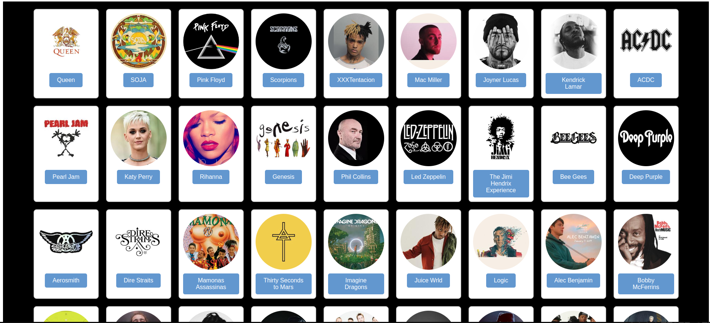
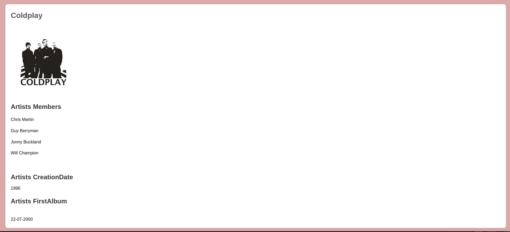
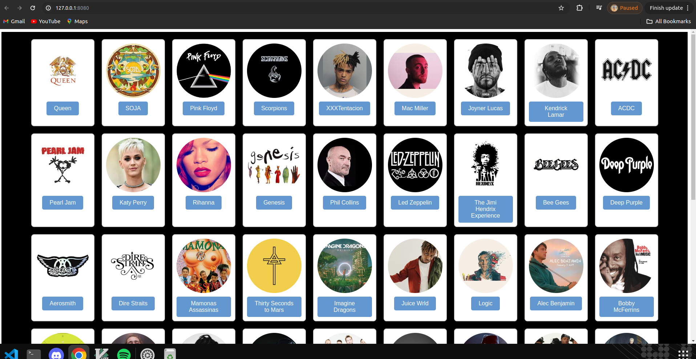
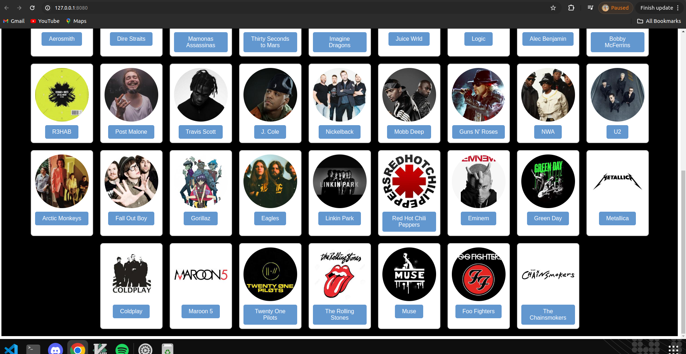
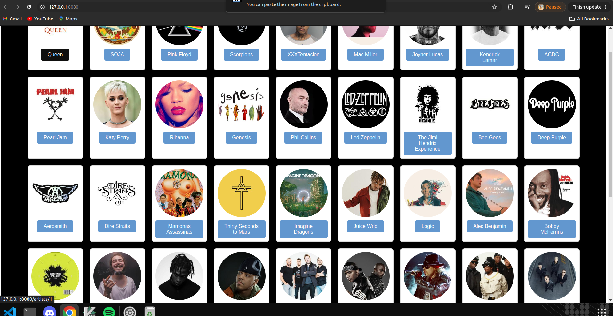
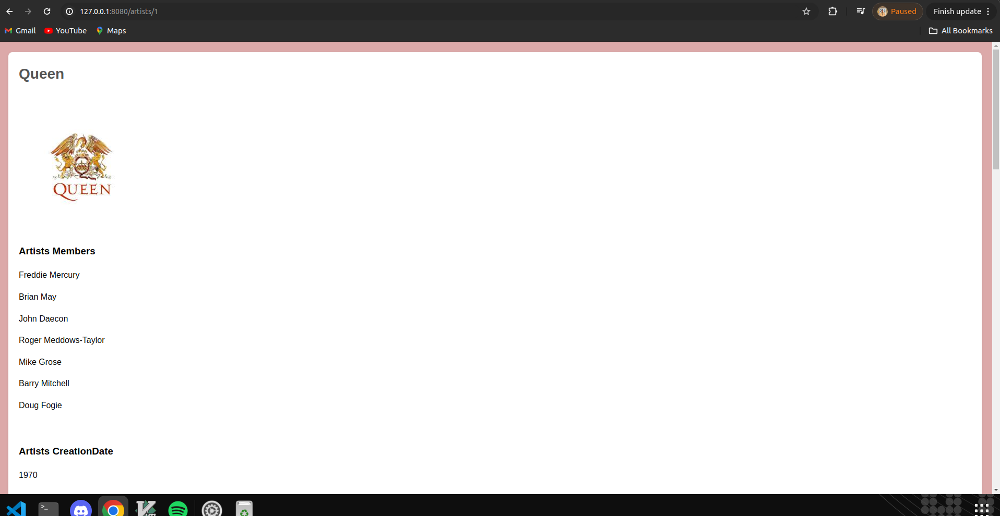
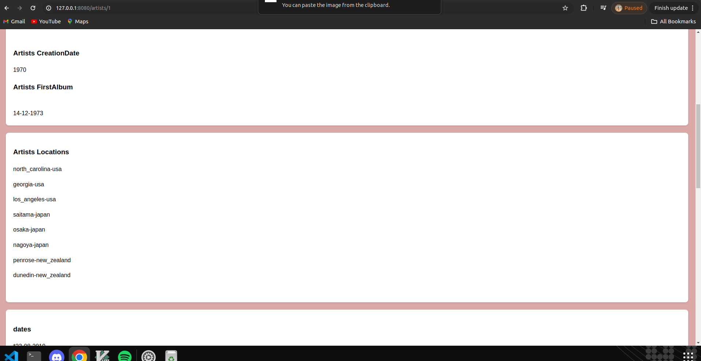
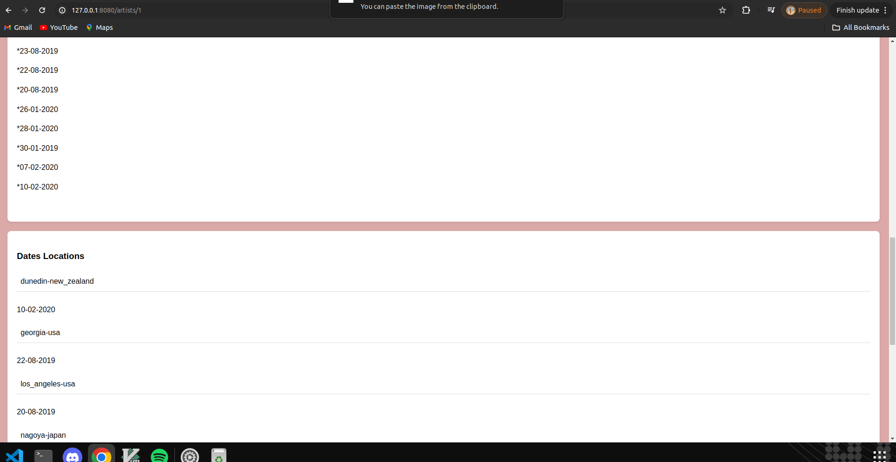
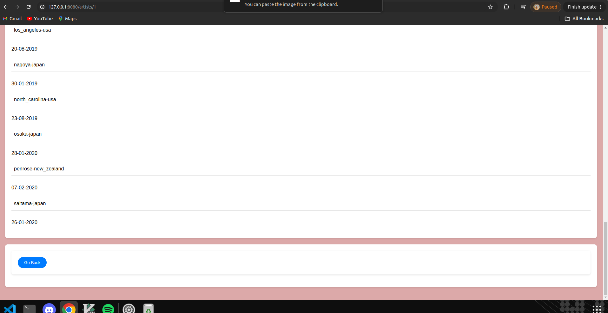

# Groupie-Tracker-visualizations

## Description

This is a simple web application that consists on receiving a given API and manipulate the data contained in it, in order to create a site, displaying the information.

## Usage

To run the application, you need to have golang installed on your machine. You can download it from [here](https://golang.org/dl/).

After installing golang, you can run the following commands to run the application:

```bash
go run .
```

This will start the server on port 8080. You can access the application by visiting [http://localhost:8080](http://localhost:8080) in your browser.

## Implementation

The application is built using golang and html. The golang server serves the html files and handles the conversion of text to .


## Authors
mohamed ghdaigui [(mghdaigu)](https://learn.zone01oujda.ma/git/mghdaigu)<br>
abdelhadi saaoud [(asaaoud)](https://learn.zone01oujda.ma/git/asaaoud)<br>
Mustapha Lbahja [(mlbahja)](https://learn.zone01oujda.ma/git/mlbahja)<br>












